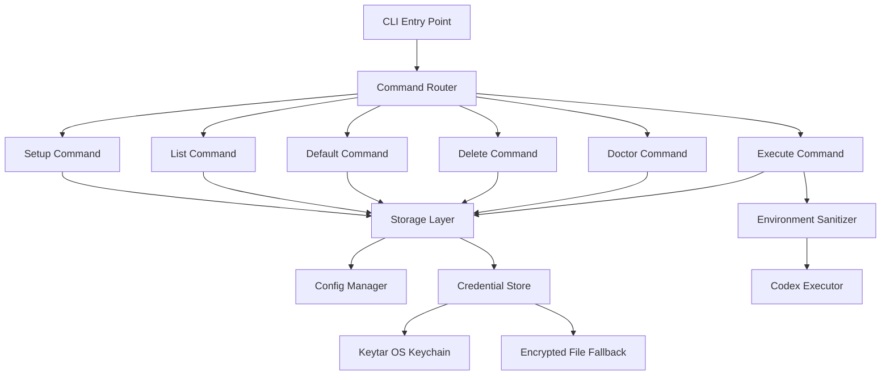
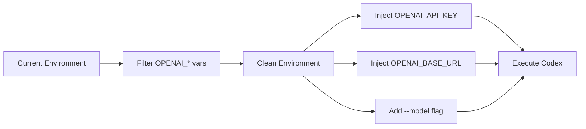
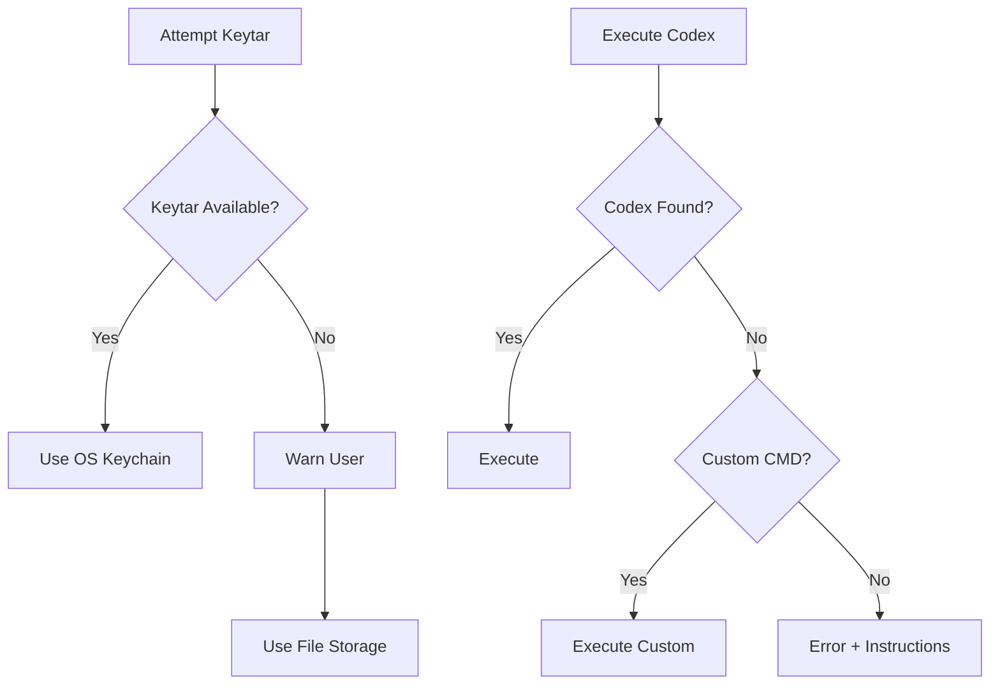

# Design Document

## Overview

The Codex Starter is a TypeScript-based CLI application that manages multiple OpenAI-compatible API profiles with secure credential storage. Inspired by the architecture patterns of ai-claude-start but implemented independently, this tool supports OpenAI ChatGPT, Kimi, Minimax, and other OpenAI-compatible APIs. The system provides profile management, environment sanitization, and secure credential handling through OS-level keychains with graceful fallback to encrypted file storage.

**Key Differentiators**:

- Original implementation with independent codebase
- Designed for OpenAI-compatible APIs (not Anthropic)
- Support for Chinese AI providers (Kimi, Minimax, etc.)
- Global NPM installation: `npm install -g ai-codex-starter`
- Different environment variable handling (OPENAI*\* vs ANTHROPIC*\*)

**Copyright and Attribution**:

- This is an original implementation inspired by the architecture patterns of ai-claude-start
- No code is directly copied; only architectural concepts and patterns are reused
- All source code is independently written for OpenAI-compatible APIs
- MIT License allows for this type of inspired work
- Proper attribution given to the original project for inspiration

## Architecture

### High-Level Architecture



### Component Layers

1. **CLI Layer**: Command parsing and user interaction (cli.ts, commands.ts)
2. **Business Logic Layer**: Profile management and execution logic (executor.ts)
3. **Storage Layer**: Configuration and credential persistence (storage.ts)
4. **Type Layer**: TypeScript interfaces and constants (types.ts)

## Components and Interfaces

### 1. Type Definitions (types.ts)

**Purpose**: Define core data structures and constants

```typescript
export interface Profile {
  name: string;
  baseUrl: string;
  model?: string;
}

export interface ProfileWithCredential extends Profile {
  credential?: string;
}

export interface Config {
  profiles: Profile[];
  defaultProfile?: string;
}

export const PRESETS: Record<string, Omit<Profile, "name">> = {
  "OpenAI ChatGPT": {
    baseUrl: "https://api.openai.com/v1",
    model: "gpt-4",
  },
  "Azure OpenAI": {
    baseUrl: "https://YOUR_RESOURCE.openai.azure.com",
    model: "gpt-4-32k",
  },
  "Kimi (Moonshot)": {
    baseUrl: "https://api.moonshot.cn/v1",
    model: "moonshot-v1-8k",
  },
  Minimax: {
    baseUrl: "https://api.minimax.chat/v1",
    model: "abab6.5-chat",
  },
};

export const SERVICE_NAME = "ai-codex-starter";
```

**Key Design Decisions**:

- Independent profile structure (not copied from Claude starter)
- Presets for both international and Chinese AI providers
- Optional model field allows per-profile model configuration
- SERVICE_NAME used as keychain service identifier
- Extensible preset system for future providers

### 2. Storage Layer (storage.ts)

**Purpose**: Manage configuration files and secure credential storage

**Key Functions**:

```typescript
// Configuration Management
export function readConfig(): Config;
export function writeConfig(config: Config): void;

// Credential Management
export async function storeCredential(
  profileName: string,
  credential: string
): Promise<void>;
export async function getCredential(
  profileName: string
): Promise<string | null>;
export async function deleteCredential(profileName: string): Promise<void>;

// Utility Functions
export async function getAllProfilesWithCredentials(): Promise<
  ProfileWithCredential[]
>;
export function isKeytarAvailable(): boolean;
```

**Storage Strategy**:

1. **Configuration File**: `~/.ai-codex-profiles.json`

   - Stores profile metadata (name, baseUrl, model)
   - Does NOT store credentials in primary mode
   - Location overridable via `AI_CODEX_CONFIG_PATH` environment variable

2. **Credential Storage (Primary)**: OS Keychain via keytar

   - macOS: Keychain
   - Windows: Credential Vault
   - Linux: Secret Service API (libsecret)
   - Service name: "ai-codex-starter"
   - Account name: profile name

3. **Credential Storage (Fallback)**: Encrypted file
   - Stored in same JSON file as config
   - Used when keytar unavailable
   - Displays warning to user about security implications

**Design Decisions**:

- Separation of config and credentials for security
- Graceful degradation when keytar unavailable
- Environment variable override for testing
- Async API for credential operations (keytar requirement)

### 3. Command Layer (commands.ts)

**Purpose**: Implement CLI command handlers

**Commands**:

```typescript
export async function setupCommand(): Promise<void>;
export async function listCommand(): Promise<void>;
export async function setDefaultCommand(profileName: string): Promise<void>;
export async function deleteCommand(profileName: string): Promise<void>;
export async function doctorCommand(): Promise<void>;
```

**Command Specifications**:

1. **setup**: Interactive profile creation wizard

   - Presents preset options (OpenAI, Azure, Custom)
   - Prompts for profile name, base URL, model, API key
   - Validates inputs before saving
   - Supports updating existing profiles

2. **list**: Display all profiles

   - Shows profile name, base URL, model
   - Indicates default profile
   - Shows credential status (present/missing)
   - Formatted with chalk for readability

3. **default**: Set default profile

   - Validates profile exists
   - Updates config with default profile name
   - Confirms action to user

4. **delete**: Remove profile

   - Prompts for confirmation
   - Removes from config
   - Deletes credentials from secure storage
   - Clears default if deleted profile was default

5. **doctor**: System health check
   - Checks Codex CLI availability
   - Reports keytar status
   - Lists all profiles with credential status
   - Validates config file integrity
   - Provides actionable recommendations

### 4. Executor Layer (executor.ts)

**Purpose**: Handle environment preparation and Codex execution

**Key Functions**:

```typescript
export function sanitizeEnvironment(): Record<string, string>;
export async function prepareEnvironment(
  profile: Profile,
  credential: string
): Promise<Record<string, string>>;
export async function executeWithProfile(
  profileName: string | undefined,
  args: string[]
): Promise<void>;
```

**Environment Sanitization Process**:



**Execution Flow**:

1. **Profile Selection**:

   - If profile specified: use it
   - If one profile exists: auto-select
   - If multiple profiles: show interactive menu
   - If no profiles: error with setup instruction

2. **Credential Retrieval**:

   - Fetch from secure storage
   - Error if missing with setup instruction

3. **Environment Preparation**:

   - Remove all OPENAI\_\* variables
   - Inject OPENAI_API_KEY with credential
   - Inject OPENAI_BASE_URL if non-default
   - Preserve all other environment variables

4. **Command Execution**:
   - Add --model flag if configured
   - Support --cmd flag for testing
   - Support CODEX_CMD environment variable
   - Pass through additional arguments
   - Inherit stdio for interactive use

**Design Decisions**:

- Complete environment isolation prevents conflicts
- Interactive selection improves UX for multiple profiles
- Custom command support enables testing without Codex CLI
- Model injection as CLI flag (not env var) for clarity

### 5. CLI Entry Point (cli.ts)

**Purpose**: Parse commands and route to handlers

**Command Structure**:

```
ai-codex-starter [command] [options]
codex-start [profile] [args...]

Commands:
  setup                 Create or update a profile
  list                  List all profiles
  default <name>        Set default profile
  delete <name>         Delete a profile
  doctor                Check system health

Options:
  --cmd <command>       Use custom command instead of codex
  --help                Show help
  --version             Show version
```

**Routing Logic**:

```typescript
// If subcommand (setup, list, etc.)
if (isSubcommand) {
  await executeSubcommand();
}
// Otherwise, treat as profile execution
else {
  const [profileName, ...args] = process.argv.slice(2);
  await executeWithProfile(profileName, args);
}
```

**Design Decisions**:

- Two binary names for flexibility (ai-codex-starter, codex-start)
- Subcommands for management, direct execution for launching
- Commander.js for robust CLI parsing
- Help text includes examples

## Data Models

### Profile Configuration

```json
{
  "profiles": [
    {
      "name": "openai",
      "baseUrl": "https://api.openai.com/v1",
      "model": "gpt-4"
    },
    {
      "name": "azure",
      "baseUrl": "https://myresource.openai.azure.com",
      "model": "gpt-4-32k"
    }
  ],
  "defaultProfile": "openai"
}
```

### Credential Storage (Fallback Mode)

```json
{
  "config": {
    "profiles": [...],
    "defaultProfile": "openai"
  },
  "credentials": {
    "openai": "sk-...",
    "azure": "..."
  }
}
```

**Note**: In primary mode (keytar), credentials object is absent from file.

### Environment Variables

**Input** (cleaned):

- All OPENAI\_\* variables removed

**Output** (injected):

- `OPENAI_API_KEY`: Profile credential
- `OPENAI_BASE_URL`: Profile base URL (if non-default)

**Special Variables**:

- `AI_CODEX_CONFIG_PATH`: Override config file location
- `CODEX_CMD`: Override codex binary for testing

## Error Handling

### Error Categories and Responses

1. **Configuration Errors**

   - Missing config file: Create default empty config
   - Corrupted config file: Display error, suggest delete/recreate
   - Invalid profile name: Show available profiles

2. **Credential Errors**

   - Missing credential: Prompt to run setup
   - Keytar unavailable: Warn and fallback to file storage
   - Keytar operation failure: Log error, attempt fallback

3. **Execution Errors**

   - Codex CLI not found: Display installation instructions
   - Profile not found: List available profiles
   - Invalid arguments: Show help text

4. **System Errors**
   - File permission errors: Display clear error message
   - Network errors: Pass through from Codex CLI
   - Spawn errors: Display command and error details

### Error Display Strategy

- Use chalk for colored output (red for errors, yellow for warnings)
- Provide actionable next steps with every error
- Include relevant context (profile name, command, etc.)
- Never expose credentials in error messages

### Graceful Degradation



## Testing Strategy

### Unit Tests

**storage.test.ts**:

- Config read/write operations
- Credential storage/retrieval (mocked keytar)
- Fallback mode behavior
- Profile CRUD operations
- Config validation

**executor.test.ts**:

- Environment sanitization
- Environment preparation
- Profile selection logic
- Command argument handling
- Model injection

**commands.test.ts**:

- Setup wizard flow
- List formatting
- Default profile setting
- Delete confirmation
- Doctor health checks

### Integration Tests

- End-to-end profile creation and execution
- Keytar fallback scenarios
- Multi-profile selection
- Environment variable isolation

### Manual Testing

```bash
# Setup and configuration
npm link
ai-codex-starter setup
ai-codex-starter list
ai-codex-starter default openai

# Execution testing
codex-start --cmd "node -e 'console.log(process.env.OPENAI_API_KEY)'"
export CODEX_CMD="env | grep OPENAI"
codex-start

# Health check
ai-codex-starter doctor

# Cleanup
ai-codex-starter delete test-profile
npm unlink
```

### Test Coverage Goals

- Unit test coverage: >80%
- All error paths tested
- Both keytar and fallback modes tested
- Environment sanitization verified

## Project Structure

```
ai-codex-starter/
├── src/
│   ├── types.ts              # Type definitions and presets
│   ├── storage.ts            # Config and credential management
│   ├── commands.ts           # CLI command implementations
│   ├── executor.ts           # Environment handling and execution
│   ├── cli.ts                # Main CLI entry point
│   ├── storage.test.ts       # Storage layer tests
│   ├── executor.test.ts      # Executor layer tests
│   └── commands.test.ts      # Command layer tests
├── dist/                     # Compiled JavaScript (generated)
├── .kiro/
│   └── specs/
│       └── codex-starter/
│           ├── requirements.md
│           ├── design.md
│           └── tasks.md
├── package.json              # NPM configuration
├── tsconfig.json             # TypeScript configuration
├── vitest.config.ts          # Test configuration
├── .gitignore                # Git ignore patterns
├── LICENSE                   # MIT License
├── README.md                 # User documentation
└── CHANGELOG.md              # Version history
```

## Dependencies

### Production Dependencies

```json
{
  "chalk": "^5.3.0", // Terminal styling
  "commander": "^11.1.0", // CLI framework
  "inquirer": "^9.2.12", // Interactive prompts
  "keytar": "^7.9.0" // Secure credential storage
}
```

### Development Dependencies

```json
{
  "@types/inquirer": "^9.0.7",
  "@types/node": "^20.10.6",
  "typescript": "^5.3.3",
  "vitest": "^1.1.0"
}
```

### System Requirements

- Node.js >= 18.0.0
- npm or yarn
- OS keychain support (optional, for secure storage)

## Security Considerations

### Credential Protection

1. **Primary Mode (Keytar)**:

   - Credentials stored in OS-level secure storage
   - Never written to disk in plaintext
   - Encrypted at rest by OS
   - Access controlled by OS permissions

2. **Fallback Mode**:

   - Credentials in JSON file (plaintext)
   - File permissions set to user-only (0600)
   - Warning displayed to user
   - Recommendation to enable keytar

3. **Runtime**:
   - Credentials only in memory during execution
   - Never logged or displayed
   - Cleared from environment after spawn
   - Not passed through command line arguments

### Configuration Security

- Config file excludes credentials in primary mode
- .gitignore prevents accidental commit
- No credentials in package.json or source code
- Environment variable override for testing isolation

### Best Practices

- Validate all user inputs
- Sanitize environment completely before injection
- Use secure spawn options (no shell injection)
- Provide clear security warnings
- Document security implications

## Performance Considerations

### Startup Time

- Config file read: ~1ms
- Keytar operation: ~10-50ms
- Interactive prompt: user-dependent
- Total overhead: <100ms

### Optimization Strategies

- Lazy load keytar module
- Cache config in memory during execution
- Minimize file I/O operations
- Use async operations for credential access

### Scalability

- Supports 100+ profiles without performance degradation
- Config file size: ~100 bytes per profile
- Memory footprint: <10MB
- No network operations during startup

## Git Repository Configuration

### Repository Details

- **URL**: https://github.com/bluehawana/ai-codex-starter.git
- **License**: MIT
- **Author**: bluehawana
- **Package Name**: ai-codex-starter

### package.json Configuration

```json
{
  "name": "ai-codex-starter",
  "version": "1.0.0",
  "description": "Multi-profile OpenAI-compatible CLI launcher with secure credential management",
  "type": "module",
  "main": "dist/index.js",
  "bin": {
    "ai-codex-starter": "./dist/cli.js",
    "codex-start": "./dist/cli.js"
  },
  "scripts": {
    "build": "tsc",
    "dev": "tsc --watch",
    "test": "vitest",
    "test:run": "vitest run",
    "prepublishOnly": "npm run build"
  },
  "repository": {
    "type": "git",
    "url": "git+https://github.com/bluehawana/ai-codex-starter.git"
  },
  "bugs": {
    "url": "https://github.com/bluehawana/ai-codex-starter/issues"
  },
  "homepage": "https://github.com/bluehawana/ai-codex-starter#readme",
  "keywords": [
    "openai",
    "chatgpt",
    "codex",
    "cli",
    "ai",
    "profile-manager",
    "azure-openai",
    "kimi",
    "minimax",
    "moonshot"
  ],
  "author": "bluehawana",
  "license": "MIT",
  "engines": {
    "node": ">=18.0.0"
  }
}
```

**NPM Installation**:

Users can install globally via:

```bash
npm install -g ai-codex-starter
```

Or use directly with npx:

```bash
npx ai-codex-starter setup
```

### .gitignore

```
node_modules/
dist/
*.log
.DS_Store
.ai-codex-profiles.json
.env
.env.local
*.tsbuildinfo
coverage/
```

### Initial Commit Structure

1. Project scaffolding (package.json, tsconfig.json, etc.)
2. Source code (src/\*.ts)
3. Tests (src/\*.test.ts)
4. Documentation (README.md, LICENSE)
5. Configuration files (.gitignore, vitest.config.ts)

### Git Workflow

```bash
# Initialize repository
git init
git add .
git commit -m "Initial commit: Codex starter CLI"

# Add remote
git remote add origin https://github.com/bluehawana/ai-codex-starter.git

# Push to GitHub
git branch -M main
git push -u origin main
```

## Future Enhancements

### Potential Features

1. **Profile Import/Export**

   - Export profiles to shareable JSON
   - Import profiles from file
   - Team profile templates

2. **Advanced Configuration**

   - Per-profile environment variables
   - Custom headers support
   - Timeout configuration

3. **Enhanced Security**

   - Encrypted file storage (not plaintext fallback)
   - Profile-level access control
   - Credential rotation reminders

4. **Developer Experience**

   - Shell completion scripts (bash, zsh, fish)
   - Profile aliases
   - Usage statistics
   - Auto-update notifications

5. **Integration**
   - VS Code extension
   - CI/CD pipeline support
   - Docker container support

### Maintenance Considerations

- Regular dependency updates
- Security audit schedule
- Compatibility testing across Node versions
- Documentation updates
- Community feedback integration
